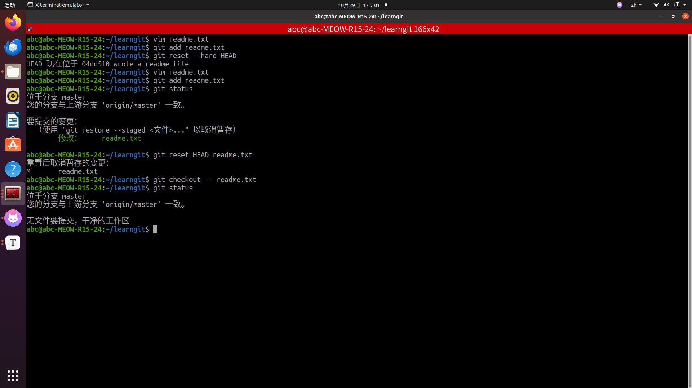
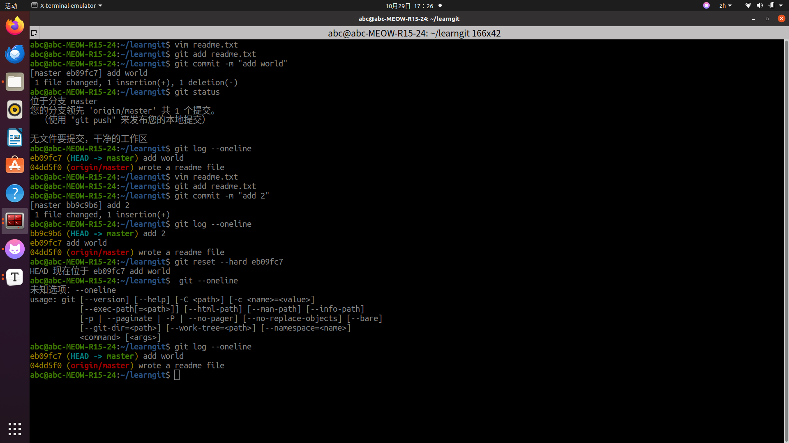
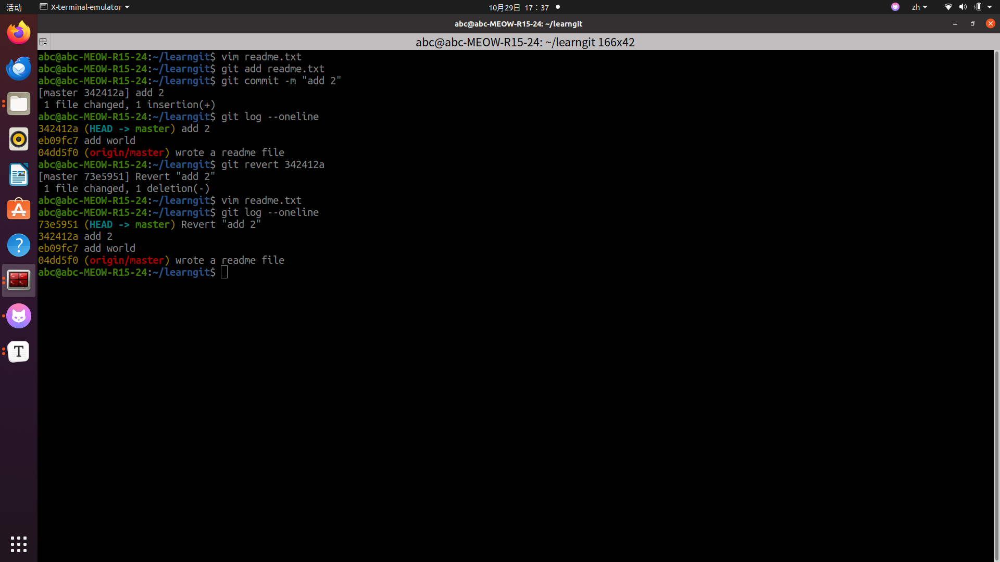
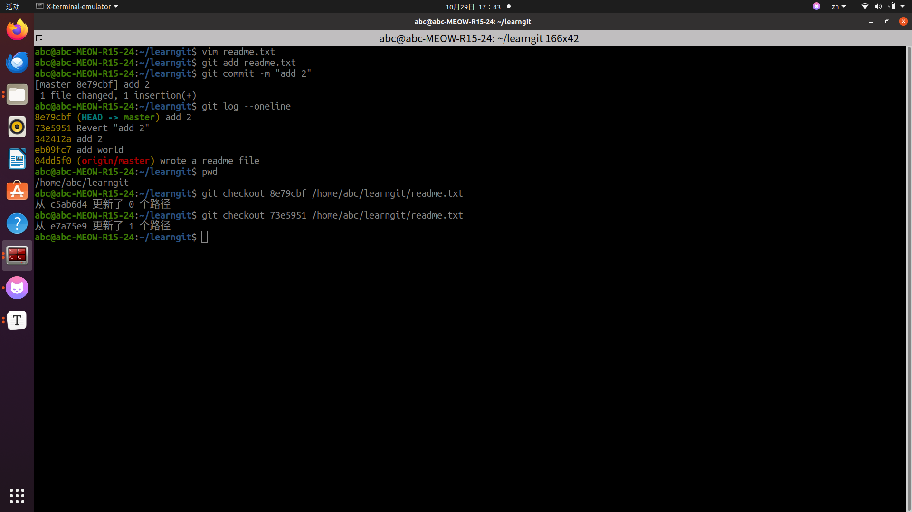
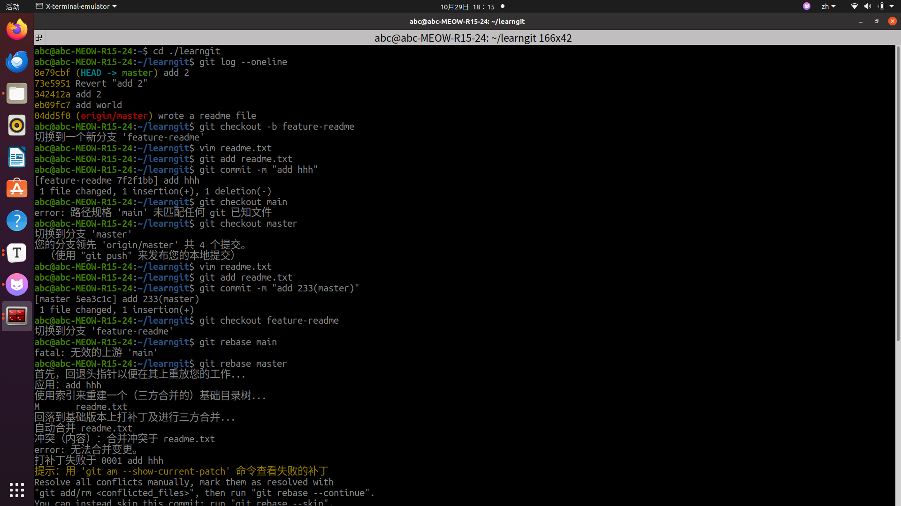
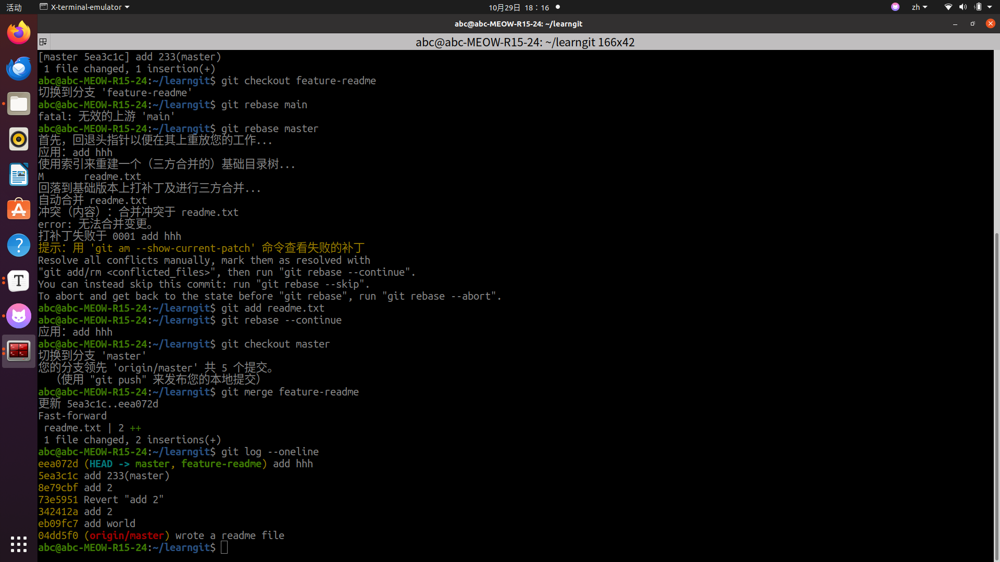
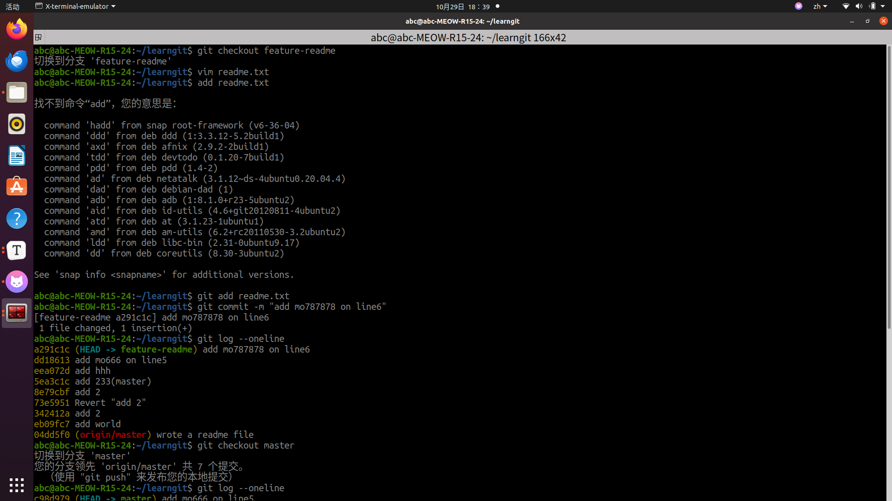
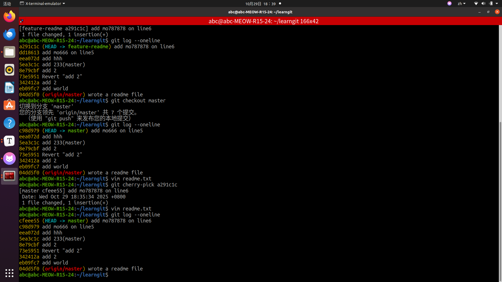

# Git 应用

## 第一题

### 方式一：

> git reset --hard HEAD

### 方式二：

> git reset HEAD readme.txt
>
> git checkout -- readme.txt

## 第二题

### 方式一：（修改历史）

> git reset --hard commit_id

### 方式二：（不修改历史）

> git revert commit_id

### 方式三：（不修改历史）

> git checkout commit_id --file

## 第三题

### 方式一：

> git rebase

### 方式二：

> git cherry-pick

